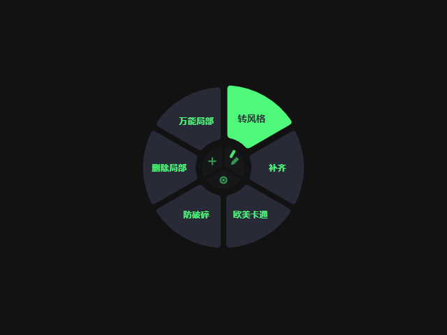

<p align="center">
  
</p>

<h1 align="center">QEA CueRing｜词环</h1>
<p align="center"><b>把常用提示词，放到鼠标身边。</b><br>Your everyday prompts, one shortcut away.</p>
<p align="center">
  <a href="#下载与使用">下载与使用</a> ·
  <a href="#english">English</a> ·
  <a href="https://github.com/zhangye2315673-hub/prompt-halo/releases">Releases</a> ·
  <a href="https://github.com/zhangye2315673-hub/prompt-halo/issues">反馈 / Feedback</a>
</p>

为游戏原画与视觉创作设计的 Windows 提示词圆环。把转风格、局部修改、补齐画面等常用提示词收进圆环，在输入框中按 **Ctrl + Alt + Q**，点击即可调用。

A Windows radial prompt menu for game concept art and visual creation. Keep reusable instructions for restyling, local edits, and image completion within reach. Focus an input field, press **Ctrl + Alt + Q**, and choose a prompt.

<p align="center">
  
</p>
<p align="center"><sub>实际应用界面 · Actual application screenshot</sub></p>

## 下载与使用

**普通用户直接下载应用，无需使用 CMD 或安装开发环境。**

前往 **[Releases 下载页面](https://github.com/zhangye2315673-hub/prompt-halo/releases)**，展开版本下的 **Assets**：

| 选择 | 文件结尾 | 怎么打开 |
| --- | --- | --- |
| **安装版 · 推荐** | `windows-x64-setup.exe` | 安装一次，从桌面或开始菜单打开。 |
| **免安装版** | `windows-x64.zip` | 完整解压一次，双击 `QEA CueRing.exe`。 |

免安装版请保留整个文件夹。GitHub 自动生成的 **Source code** 压缩包是源码，不是可直接运行的应用。

### 三步调用

1. **定位**：把光标放进目标输入框。
2. **呼出**：按 **Ctrl + Alt + Q**。
3. **选择**：点击扇区，提示词写入原输入框。按 **Esc** 可关闭圆环。

### 在圆环里管理提示词

| 操作 | 用法 |
| --- | --- |
| 新增 | 点击中心 **＋**，填写标题和正文。 |
| 编辑 | 点击中心 **笔图标**，再选择要编辑的扇区。 |
| 展开 | 点击中心 **外圈按钮**，切换更多提示词位置。 |
| 备份与迁移 | 右键托盘图标，选择导出、导入或恢复历史备份。 |

提示词在本机保存；修改内容前自动备份，最近十份可供恢复。未保存的编辑会在关闭前提示确认。

<details>
<summary><b>更新、数据位置与常见问题</b></summary>

- **更新**：先从托盘退出旧版。安装版使用原安装路径；免安装版解压到新的空文件夹。建议更新前导出词库。
- **数据位置**：`%APPDATA%/prompt-halo`；自动备份位于 `library-backups` 子目录。两种分发方式共用该位置。
- **快捷键无效**：检查是否被其他应用占用；可以从托盘打开圆环，解决冲突后重启。
- **系统组件**：普通使用无需 Node.js、npm 或 Python；输入助手使用 Windows PowerShell 和 .NET/UIAutomation，企业电脑策略可能限制运行。
- **启动失败**：按错误提示查看 `startup-error.txt`。反馈时提供应用版本、Windows 版本、复现步骤与错误信息，请勿公开个人词库。

</details>

## English

### Download

Get the app from **[GitHub Releases](https://github.com/zhangye2315673-hub/prompt-halo/releases)** → **Assets**. No command-line setup is needed for regular use.

| Package | How to use |
| --- | --- |
| **Installer — recommended** (`windows-x64-setup.exe`) | Install once, then open CueRing from the desktop or Start menu. |
| **ZIP** (`windows-x64.zip`) | Extract the entire archive once and run `QEA CueRing.exe`. Keep its accompanying files. |

GitHub's **Source code** archives are for development, not ready-to-run applications.

### Use the ring

1. Focus the input field where you want to insert text.
2. Press **Ctrl + Alt + Q** to summon the ring.
3. Click a sector to insert its prompt. Press **Esc** to dismiss the ring.

The center controls let you **add a prompt**, **select a sector to edit**, and **toggle the outer ring**. Right-click the tray icon to open CueRing, import or export your library, restore a backup, or quit.

Prompts stay on your computer. Changes are backed up automatically, with the ten most recent snapshots retained. Closing an unsaved edit asks for confirmation.

<details>
<summary><b>Updates and troubleshooting</b></summary>

- Quit the old app before updating and export your library first. Install over the existing installation, or extract a ZIP update into a new empty folder.
- Both packages use `%APPDATA%/prompt-halo`; backups live in its `library-backups` subfolder.
- If the shortcut is occupied, use the tray menu, resolve the conflict, and restart CueRing.
- Node.js, npm, and Python are not required for normal use. The input helper uses Windows PowerShell and .NET/UIAutomation; organizational policies may restrict these components.
- Startup failures show an error and the location of `startup-error.txt`. Include your app version, Windows version, steps, and error message when reporting a problem. Do not post your personal prompt library.

</details>

## 开发 · Development

```powershell
npm ci
npm run desktop
```

```powershell
npm run build:win      # 目录版 / unpacked application
npm run build:release  # 安装版 / Windows installer
```

构建前退出应用。目录版输出至 `release/win-unpacked`。  
Quit the app before building. The unpacked app is written to `release/win-unpacked`.

<details>
<summary><b>运行检查 · Run checks</b></summary>

```powershell
npm run test:input-contract
npm run test:menu
node tests/library.cjs
node tests/dirty-close.cjs
```

自动检查覆盖输入实现保护、菜单生命周期和词库逻辑。目标应用中的实际输入仍需实机验证。  
Automated checks cover input implementation safeguards, menu lifecycle, and library logic. Actual insertion into target applications requires native testing.

</details>

## 许可 · Licensing

项目尚未选定开源许可证。第三方声明见 [THIRD-PARTY-NOTICES.txt](THIRD-PARTY-NOTICES.txt)，分发时保留随包提供的许可文件。  
An open-source license has not yet been selected for this project. See [THIRD-PARTY-NOTICES.txt](THIRD-PARTY-NOTICES.txt) and retain the bundled license files when redistributing the app.

[版本说明 / Release notes](docs/release-0.2.0.md)
